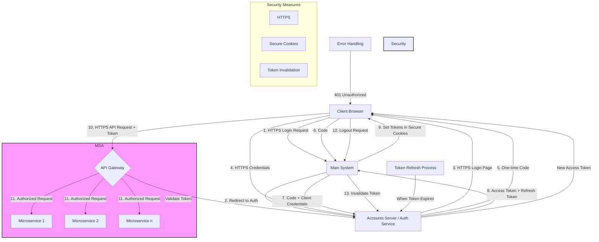

# OAuth 2.0 Implementation for Microservices Architecture

## Project Overview
Developed an OAuth 2.0 authentication system to address the lack of shared login authentication in a new Microservices Architecture (MSA). The system issues tokens for use across MSA components when users log in to the main system.

## Architecture

## Key Challenges
- Absence of shared login authentication between main codebase and new MSA structure
- Need for a token system usable across multiple microservices

## Technical Implementation
- Registered applications on the accounts server to issue APIs
- Implemented one-time code issuance when customers log in via their browser
- Developed a process to exchange the one-time code for an access token, which is then used for API requests

## Achievements
- Enabled independent development and deployment of MSAs by multiple squads in a multi-team service operation environment
- Implemented a system where a single customer login event grants all necessary permissions for MSA operations

## Technologies Used
- OAuth 2.0
- API development
- Token-based authentication
- Microservices Architecture (MSA)
